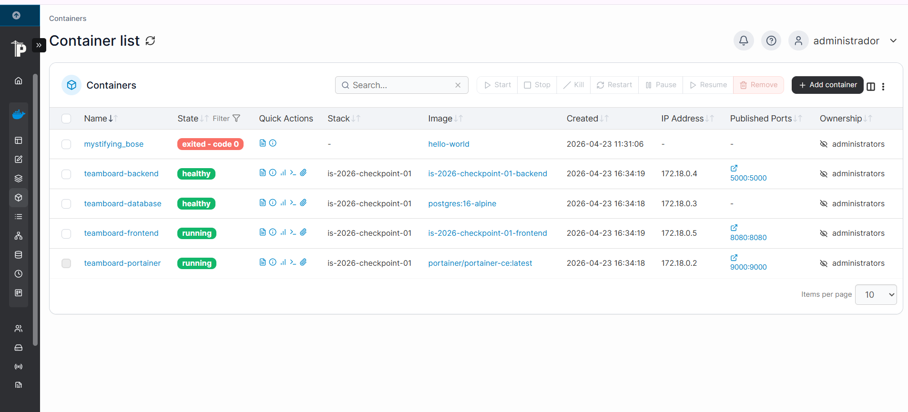

# Proyecto IS-2026 - Checkpoint 01

## Descripción
Este proyecto consiste en una implementación desplegada mediante contenedores Docker para garantizar la paridad de entorno entre desarrollo y producción. El sistema incluye una API RESTful (Backend), una interfaz de usuario (Frontend) y una base de datos relacional (Postgres).

## Equipo de Desarrollo
A continuación se detalla la conformación del equipo y las áreas de responsabilidad asignadas:

| Nombre | Legajo | GitHub User | Feature |
| :--- | :--- | :--- | :--- |
| **Pértile de la Vega Valentina** | 33288 | @valentinapertile | Coordinación / Backend |
| **Suárez Pavicich María Luana** | 33210  | @luana-suarez| Database |
| **Romero Olmo Macarena** | 33372 | @macarena-1973 | Frontend / Portainer |

## Tecnologías Utilizadas
* **Backend:** Python 
* **Base de Datos:** PostgreSQL
* **Infraestructura:** Docker & Docker Compose
* **Gestión de Versiones:** Git & GitHub

## Requisitos Previos
Para ejecutar este proyecto, asegúrate de tener instalado:
1. [Docker Desktop](https://www.docker.com/products/docker-desktop/) (o Docker Engine con Compose).
2. [Git](https://git-scm.com/).


## Accesos
* Frontend: http://localhost:8080
* Backend health: http://localhost:5000/api/health
* Backend team: http://localhost:5000/api/team
* Backend info: http://localhost:5000/api/info
* Portainer: http://localhost:9000

---

## Estructura del proyecto

```text
is-2026-checkpoint-01/
├── docker-compose.yml
├── .env.example
├── .gitignore
├── README.md
├── frontend/
│   ├── Dockerfile
│   ├── .dockerignore
│   └── html/
│       ├── index.html
│       └── app.js
├── backend/
│   ├── Dockerfile
│   ├── .dockerignore
│   ├── requirements.txt
│   └── app.py
├── database/
│   └── init.sql
└── portainer/

``` 

## Instalación y Ejecución

1. Clonar el repositorio:
```bash
   git clone https://github.com/ValentinaPertile/is-2026-checkpoint-01
   cd is-2026-checkpoint-01
```

2. Configurar las variables de entorno:
```bash
   cp .env.example .env
   # Completar los valores en .env
```

3. Levantar los servicios:
```bash
   docker compose up -d --build
```

4. Verificar que todos los servicios están corriendo:
```bash
   docker compose ps
```


## Descripción de Features

**Feature 01 — Coordinación e Infraestructura (Valentina Pertile)**
Creación del repositorio en GitHub, configuración de branch protection en main e invitación a las compañeras como colaboradoras. Su entregable principal es el `docker-compose.yml` que orquesta los 4 servicios, el `.env.example` con las variables necesarias y el `README.md` con la documentación completa del proyecto.

**Feature 02 — Frontend (Macarena Romero)**
Página HTML servida por `python3 -m http.server` en el puerto 8080. El archivo `app.js` realiza un `fetch()` al backend para obtener los datos del equipo y construye la tabla dinámicamente con JavaScript, sin datos hardcodeados en el HTML.

**Feature 03 — Backend (Valentina Pertile)**
API REST desarrollada con Flask que corre en el puerto 5000. Expone tres endpoints: `/api/health` para verificar que el servicio está activo, `/api/team` que lee los integrantes desde PostgreSQL y `/api/info` con metadata del servicio. Las credenciales de la base de datos se inyectan por variables de entorno.

**Feature 04 — Base de Datos (María Luana Suárez)**
PostgreSQL 16 en contenedor usando la imagen oficial `postgres:16-alpine`. El archivo `init.sql` crea la tabla `members` e inserta una fila por cada integrante. Los datos persisten en un volumen nombrado aunque el contenedor sea destruido.

**Feature 05 — Portainer (Macarena Romero)**
Panel web de monitoreo accesible en `http://localhost:9000`. Configurado en el `docker-compose.yml` montando el socket de Docker para comunicarse con el daemon. Permite visualizar el estado de todos los contenedores del proyecto sin usar la terminal.

---
## Portainer

Portainer permite visualizar y monitorear los contenedores Docker del proyecto desde el navegador.

### Acceso

Abrir: http://localhost:9000

### Primer ingreso

La primera vez que se abre Portainer, se solicita crear un usuario administrador.

### Qué verificar

Dentro de Portainer deben verse los contenedores del proyecto:

- teamboard-frontend
- teamboard-backend
- teamboard-database
- teamboard-portainer

### Evidencia


